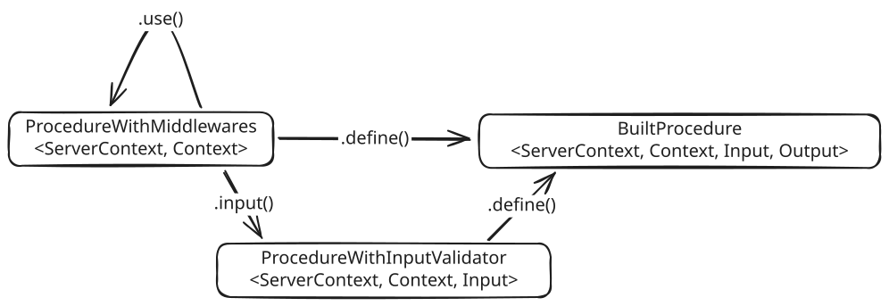

# Usage

+ see [`src/_example.ts`](src/_example.ts)

<br>

```ts
const a = procedure
  .use(() => ({ abc: 123 }))
  .use((context) => ({ ...context, xyz: 123 }))
  .input(z.string())
  .define(({ context, input }) => {
    console.log({ context, input });
  });
```

<br>

# Development

+ Todo:
  - server middlewares
  - try to unify procedures with context

<br>

+ Query builder documentation:
  - 
