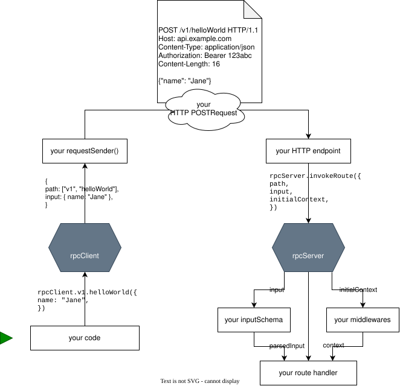
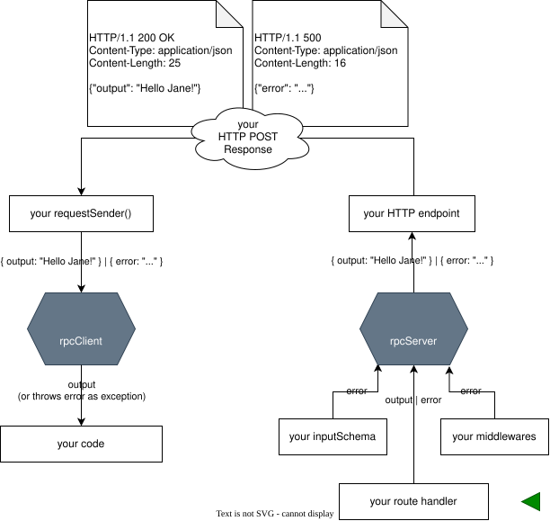
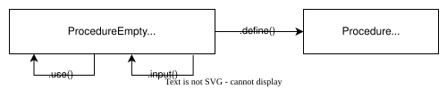
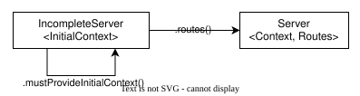
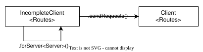

# RPC
A high-performance remote procedure call (RPC) library for Typescript.

<br>

## Usage

### Installing
```bash
npm install @petrhdk/rpc
```
https://www.npmjs.com/package/@petrhdk/rpc


### Server code
```ts
import { Buffer } from 'node:buffer';
import * as http from 'node:http';
import * as rpc from '@petrhdk/rpc';

export interface MyServerContext {
  requestHeaders: http.IncomingHttpHeaders,
};

const server = rpc.server
  .mustProvideInitialContext<MyServerContext>()
  .routes({
    v1: {
      getItem: rpc.procedure
        .needsInitialContext<MyServerContext>()
        .use(({ requestHeaders }) => {
          // ...
          return { authenticatedUser: 'user1' };
        })
        .input(z.object({
          itemId: z.string(),
        }))
        .define(({ itemId }, { authenticatedUser }) => {
          // ...
          const item = { /* ... */ };
          return item;
        }),
    },
  });
export type MyServer = typeof server;

http.createServer(async (request, response) => {
  // handle RPC requests
  if (request.method === 'POST') {
    const responsePayload = await server.invokeRoute({
      path: (request.url ?? '/').split('/').slice(1),
      input: JSON.parse(await readBodyAsString(request)),
      initialContext: {
        requestHeaders: request.headers,
      },
    });
    response.writeHead(200);
    response.end(JSON.stringify(responsePayload));
  }

  // handle preflight requests
  if (request.method === 'OPTIONS') {
    // ...
  }
}).listen(3000);

async function readBodyAsString(request: http.IncomingMessage) {
  const chunks = [];
  for await (const chunk of request) {
    chunks.push(chunk);
  }
  return Buffer.concat(chunks).toString();
}
```

### Client code
```ts
import * as rpc from '@petrhdk/rpc';

const client = rpc.client
  .forServer<MyServer>()
  .sendRequests(async ({ path, input }) => {
    const httpResponse = await fetch(
      `https://example.com/${path.join('/')}`,
      {
        method: 'POST',
        body: JSON.stringify(input),
      },
    );
    return await httpResponse.json() as rpc.ResponsePayload;
  });

client.v1.getItem({ itemId: 'abc' });
```

<br>

## How it works

### Request


### Response


### Procedure builder


### Server builder


### Client builder

